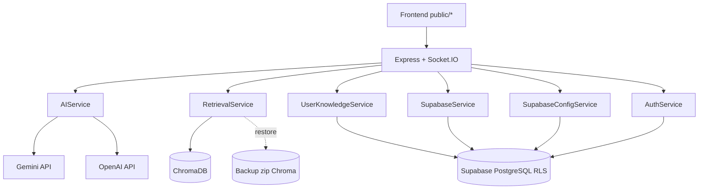
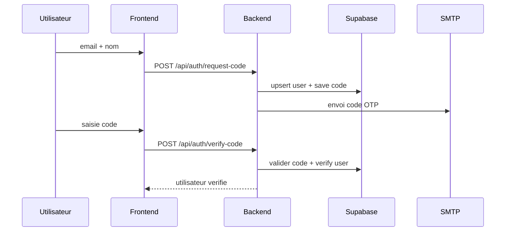
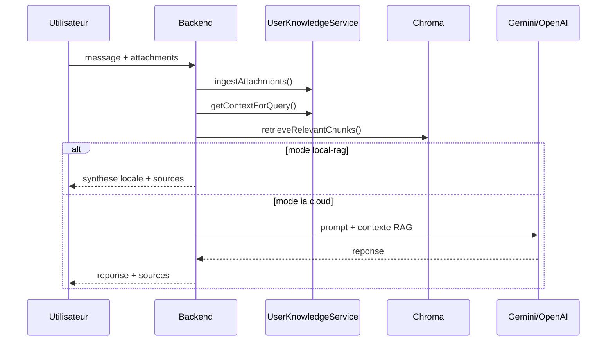

# DAT - Document d'Architecture Technique

## 1) Portee et objectif

`DevOps Assistant Bot` est une application web Node.js qui assiste les juniors DevOps en proposant:

- réponses IA contextualisées (Gemini / OpenAI),
- réponses locales via RAG quand aucune clé IA n'est disponible,
- ingestion continue de PDF de cours et de documents utilisateur,
- authentification email OTP et isolation des données par utilisateur.

## 2) Architecture cible (etat actuel)

## 3) Composants techniques

### Frontend

- Pages: `login.html`, `registration.html`, `index.html`, `configuration.html`, `home.html`
- Chat temps reel via Socket.IO
- Upload pieces jointes (PDF/TXT/JSON/LOG) pour enrichment de contexte

### Backend

- `src/index.js`: routes REST + websocket + orchestration
- `src/ai-service.js`: selection provider, prompt, synthese locale RAG
- `src/rag/retrieval-service.js`: query Chroma + diversification des sources
- `src/rag/ingest-pdfs.js`: chunking et indexation corpus `data_course/`
- `src/user-knowledge-service.js`: ingestion documents utilisateur dans Supabase
- `src/auth-service.js`: OTP email (request/verify)

### Donnees et persistance

- Supabase PostgreSQL:
  - `users`, `auth_verification_codes`
  - `conversations`, `user_configs`
  - `user_knowledge_chunks`, `error_logs`, `system_metrics`
- ChromaDB:
  - collection RAG `devops_courses`
  - mode fallback par URL secondaire + restoration zip

## 4) Flux fonctionnels

### 4.1 Authentification OTP

### 4.2 Reponse chatbot online/offline

## 5) Choix d'architecture et justification

- Node.js + Socket.IO: simple pour une UX chat temps reel.
- Supabase + RLS: persistance SQL + securite ligne par ligne.
- ChromaDB: moteur vectoriel local compatible mode offline.
- Multi-provider IA: flexibilité cout/disponibilite (Gemini/OpenAI/local).
- Fallback Chroma backup: resilence en environnement contraint.

## 6) Securite

- OTP email obligatoire avant usage du bot
- RLS sur les tables utilisateur
- variables sensibles via `.env` (non committe)
- validations backend des donnees entrantes

## 7) Conteneurisation et deploiement

- Local/prod-like via `docker-compose.yml`
- Image app via `Dockerfile`
- pipeline GitLab CI/CD (`.gitlab-ci.yml`) avec stages build/test/security/deploy
- cible cloud Render (`render.yaml`)

## 8) Dossier architecture detaille

Voir egalement:

- `docs/architecture/01-overview.md`
- `docs/architecture/02-components.md`
- `docs/architecture/03-runtime-flows.md`
- `docs/architecture/04-deployment-cicd.md`
