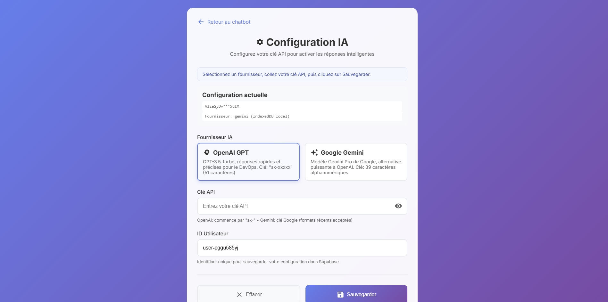
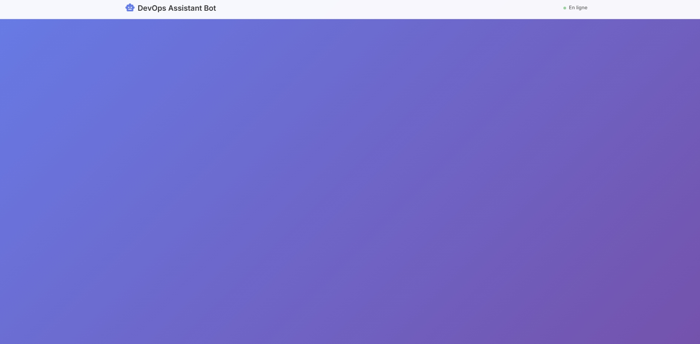
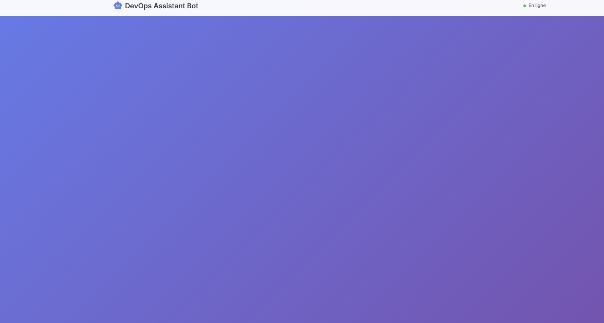
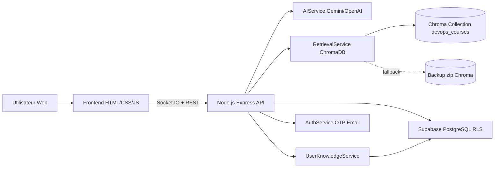
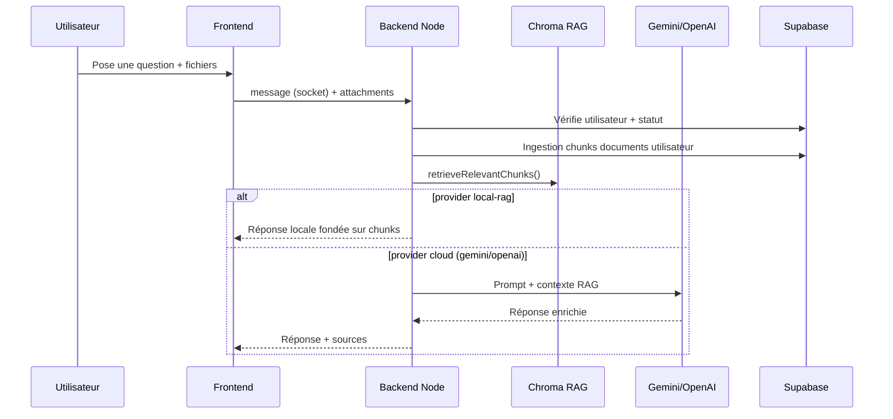

# DevOps Assistant Bot


Assistant DevOps orienté juniors, conçu pour expliquer, guider et entraîner sur des cas concrets de déploiement, CI/CD, monitoring et troubleshooting.

## Contexte du projet

Ce projet est le fil conducteur de fin de formation de la bourse **Africa Tech Tour 2025** (parcours DevOps).  
L'objectif est de fournir une solution utile en conditions réelles, pas seulement une démo:

- interface simple pour poser des questions DevOps en français
- réponses fondées sur des documents de cours (RAG)
- mode connecté (IA cloud) et mode autonome (offline/local RAG)
- architecture documentée, conteneurisable et industrialisable

## Ce qui rend la solution originale

La plupart des assistants "DevOps" sont soit purement LLM, soit purement FAQ.  
Ici, la solution combine trois niveaux de robustesse:

1. **Mode online IA**: réponses enrichies avec Gemini/OpenAI quand une clé est disponible.
2. **Mode offline/local RAG**: le bot continue à répondre à partir du corpus PDF local sans dépendre d'une clé API.
3. **Mode résilient RAG**: fallback Chroma + restauration de backup zip configurable en cas d'indisponibilité.

Cette approche est pensée pour les contextes à connectivité variable et pour l'apprentissage progressif des juniors.

## Pour qui ?

- apprenants DevOps débutants
- développeurs en transition vers DevOps
- équipes pédagogiques qui veulent un assistant contextualisé à leur contenu de formation

## Captures d'écran (dossier `media`)

### Logo application


### Écran d'accueil / connexion


### Conversation bot


### Configuration IA / RAG


## Architecture globale (Mermaid)



## Flux de réponse (offline/online)



## Stack technique

- **Backend**: Node.js, Express, Socket.IO
- **Frontend**: HTML, CSS, JavaScript vanilla
- **IA**: Gemini (principal), OpenAI (optionnel)
- **RAG**: ChromaDB + ingestion PDF + embeddings locaux
- **Données**: Supabase PostgreSQL + RLS
- **DevOps**: Docker, GitLab CI/CD, Render

## Fonctionnalités principales

- Authentification email par code OTP (inscription/connexion)
- Affichage du compte connecté + nombre d'utilisateurs connectés
- Configuration IA par utilisateur (OpenAI/Gemini/local-rag)
- Réponses RAG avec citations de sources
- Upload de documents utilisateur (PDF/TXT/JSON/LOG) chunkés automatiquement
- Base de connaissance par utilisateur (`user_knowledge_chunks`)

## Dossier d'architecture technique

Le dossier complet est disponible dans:

- `DAT.md`
- `docs/architecture/01-overview.md`
- `docs/architecture/02-components.md`
- `docs/architecture/03-runtime-flows.md`
- `docs/architecture/04-deployment-cicd.md`

## Lancement rapide

```bash
npm install
npm run start
```

Application: `http://localhost:3000`

## Ingestion des PDF de cours

1. Déposer les PDF dans `data_course/`
2. Lancer ChromaDB
3. Exécuter:

```bash
npm run rag:ingest
```

## Variables d'environnement clés

- `RAG_ENABLED=true`
- `RAG_COLLECTION=devops_courses`
- `RAG_MAX_CHUNKS_PER_DOC=1200`
- `RAG_INGEST_BATCH_SIZE=4`
- `RAG_RETRIEVAL_TOP_K=16`
- `CHROMA_URL` / `CHROMA_FALLBACK_URL`
- `RAG_CHROMA_BACKUP_URL`
- `SUPABASE_URL`, `SUPABASE_ANON_KEY`
- `SMTP_HOST`, `SMTP_PORT`, `SMTP_USER`, `SMTP_PASS`

## Migrations Supabase à exécuter

- `database/migrations/20260331_add_user_knowledge_chunks.sql`
- `database/migrations/20260331_add_users_and_auth_codes.sql`
- `database/migrations/20260331_add_users_full_name.sql`
- `database/migrations/20260331_fix_auth_rls_backend_access.sql`

## Déploiement et CI/CD

- Conteneurisation: `Dockerfile` + `docker-compose.yml`
- CI/CD: `.gitlab-ci.yml` (build, test, security, deploy)
- Cible cloud: `render.yaml`

## Références dépôt

- GitHub: [Sidoine1991/DevOps-Assistant-Bot](https://github.com/Sidoine1991/DevOps-Assistant-Bot)
- GitLab: [sidoine1991-group/devops-assistant-bot](https://gitlab.com/sidoine1991-group/devops-assistant-bot)
