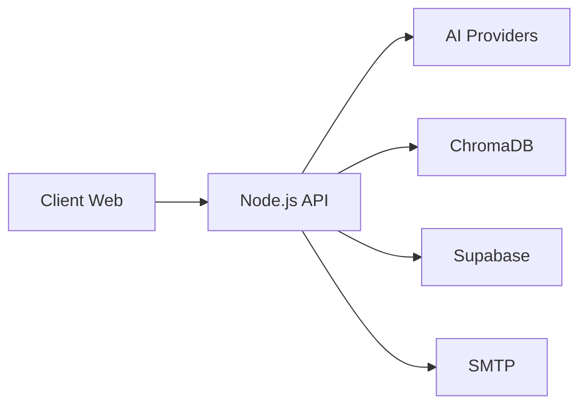

# Architecture - Vue d'ensemble

## Vision

Le bot est concu pour accompagner les juniors DevOps sur des cas concrets, meme en mode connectivite limitee.

Le systeme combine:

- mode online (Gemini/OpenAI),
- mode offline (local-rag),
- base de connaissances cours + documents utilisateur,
- authentification OTP et stockage securise.

## Carte systeme

## Valeur pour les juniors DevOps

- expliquer les erreurs en langage accessible,
- proposer des actions concretes (pas seulement des definitions),
- garder un historique utilisateur/contextuel,
- repondre meme sans cle IA cloud.
