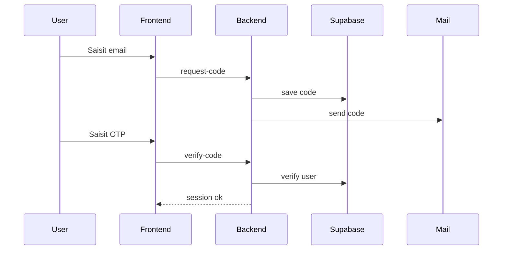
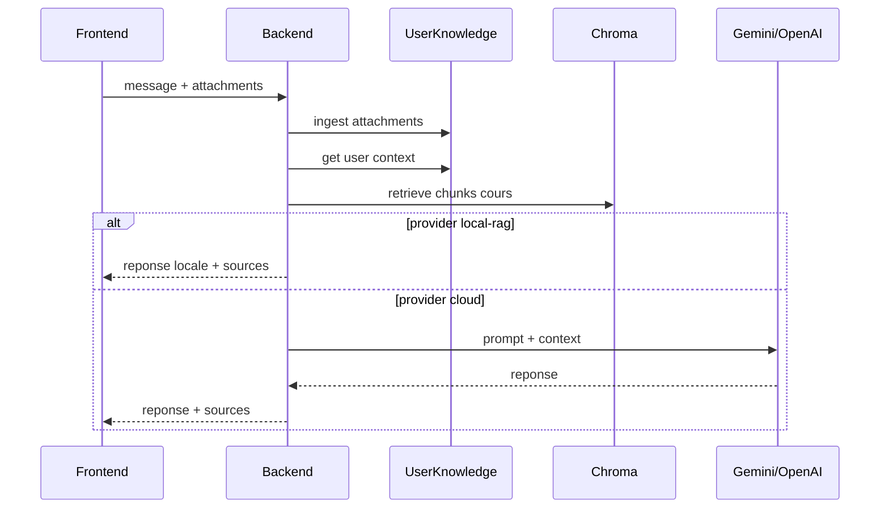

# Architecture - Flux runtime

## Flux 1: Login OTP

```mermaid
sequenceDiagram
    participant U as User
    participant FE as Frontend
    participant API as Backend
    participant DB as Supabase
    participant SMTP as Mail

    U->>FE: Saisit email
    FE->>API: request-code
    API->>DB: save code
    API->>SMTP: send code
    U->>FE: Saisit OTP
    FE->>API: verify-code
    API->>DB: verify user
    API-->>FE: session ok
```

## Flux 2: Question chatbot

```mermaid
sequenceDiagram
    participant FE as Frontend
    participant API as Backend
    participant UK as UserKnowledge
    participant RAG as Chroma
    participant IA as Gemini/OpenAI

    FE->>API: message + attachments
    API->>UK: ingest attachments
    API->>UK: get user context
    API->>RAG: retrieve chunks cours
    alt provider local-rag
      API-->>FE: reponse locale + sources
    else provider cloud
      API->>IA: prompt + context
      IA-->>API: reponse
      API-->>FE: reponse + sources
    end
```
